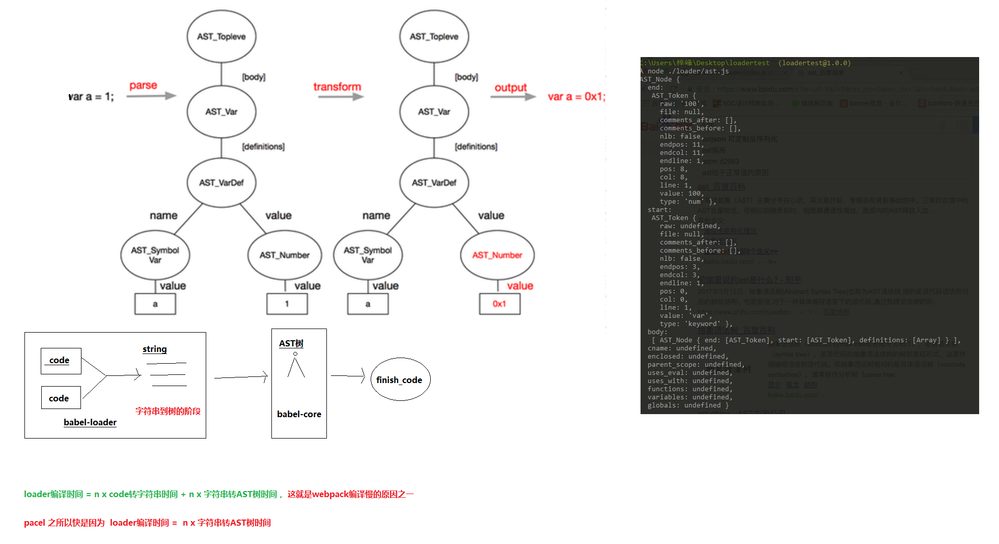

# webpack技术内幕
## 入口文件
> 对于多入口文件，如何巧妙地编写入口
```
//例如 文件都起名为 xxx-xxx.entry.js
let _entry = {};
if (/.+\/([a-zA-Z]+-[a-zA-Z]+)(\.entry\.js$)/g.test(item) == true) {
 const entrykey = RegExp.$1
 _entry[entrykey] = item;
 const [dist, template] = entrykey.split(“-");
 }
```
## Module浅析
### 开启对Webpack多核的支持
> - Webpack是基于NodeJS的，所以开启多核编译来加快编译速度
> - 利用happypack插件来实现
> - webpack5会集成happywebpack，静静地等待...
```
const HappyPack = require('happypack');
const os = require('os');
//开辟一个线程池
const happyThreadPoll = HappyPack.ThreadPool({ size: os.cpus().length });
module.exports.plugins = [
    new HappyPack({
        id: 'babel',
        threadPool: happyThreadPoll,
        loaders: [{
            loader: 'babel-loader'
        }]
    }),
    new HappyPack({
        id: 'css',
        threadPool: happyThreadPoll,
        loaders: [{
            loader: 'css-loader', 
            options: { importLoaders: 1 } 
        },'postcss-loader']
    })
];
//集成到webpack.config.js
module: {
    rules: [
        {
            test: /\.js$/,
            exclude: /(node_modules)/,
            use: 'happypack/loader?id=babel',
        },
        {
            test: /\.css$/,
            exclude: /(node_modules)/,
            use: 'happypack/loader?id=css',
        }, 
    ]
}
```

### Loader的原理分析


### AST静态语法分析树
> - 以uglify-js为例，分析一下AST树是个啥

```
var UglifyJS = require('uglify-js');
var code = 'var a = 100';
var ast = UglifyJS.parse(code);//AST语法分析树‘
var transformer = new UglifyJS.TreeTransformer(function(node){
    if(node instanceof UglifyJS.AST_Number){//查找需要修改的叶子节点
        node.value = '0x' + Number(node.value).toString(16);//转成16进制
        return node;//返回一个新的叶子节点，替换原来的叶子节点
    }
});
ast.transform(transformer);//遍历AST树
var ncode = ast.print_to_string();//从AST还原成字符串
console.log(ncode);//var a = 0x1;
```
### 如何开发一个自己的Loader
```
//入口文件
const a = 20;
-------------------------
loader/index.js
-------------------------
//loader执行之前
module.exports.pitch = function(r1,r2,data){
    data.value = 'yd';
}
//同步loader
module.exports = function(content, map, meta){
    console.log('得到的数据', content);//将const a = 20;转化成buffer <Buffer xxxxx ... >
    console.log('loader预先得到的数据', this.data.value);//yd
    return '{};'+content;
    // this.callback(null, content, map, meta);
};
//异步loader
module.exports = function(content, map, meta){
 var callback = this.async();
 (funciton(){....}).then(function(){
     if(err){
         callback(err);
     }else{
         callback(null, ......)
     }
 })
};
//流的方式
//module.exports.raw = true;
-----------------------------------
webpack.config.js
-----------------------------------
const path = require('path');
module.exports = {
    module: {
        rules: [
            {
                test: /\.js$/,
                loader: path.resolve('./loader/index.js')
            }
        ]
    }
};
//最后生成代码
eval("{};const a = 20;\r\n\r\n//import bar from './bar.js';\r\n//bar.init();\n\n//# sourceURL=webpack:///./src/index.js?");
```

## Plugins
事件钩子会有不同的类型 SyncBailHook，AsyncSeriesHook，SyncHook等
如果是异步的事件钩子，那么可以使用 tapPromise 或者 tapAsync 来注册事件函数，tapPromise 要求方法返回 Promise 以便处理异步，而 tapAsync 则是需要用 callback 来返回结果
```
compiler.hooks.done.tapPromise('PluginName', (stats) => {
    return new Promise((resolve, reject) => {
    // 处理promise的返回结果 reject(err) : resolve()
});
compiler.hooks.done.tapAsync('PluginName', (stats, callback) => {
    callback( err)) 
});
```
除了同步和异步的，名称带有 parallel 的，注册的事件函数会并行调用，名称带有 bail 的，注册的事件函数会被顺序调用，直至一个处理方法有返回值名称带有 waterfall 的，每个注册的事件函数，会将上一个方法的返回结果作为输入参数。有一些类型是可以结合到一起的，如 AsyncParallelBailHook，这样它就具备了更加多样化的特性
```
const pluginName = 'ConsoleLogOnBuildWebpackPlugin';
class ConsoleLogOnBuildWebpackPlugin {
    apply(compiler) {
        // 在 compiler的hooks中注册一个方法，当执行到该阶段时会调用
        compiler.hooks.run.tap(pluginName, compilation => {
            console.log("The webpack build process is starting!!!");
        });
    }
}
//使用
plugins: [
    new ConsoleLogOnBuildWebpackPlugin()
]
webpack 利用了 tapable 这个库（https://github.com/webpack/tapable）来协助实现对于整个构建流程各个步骤的控制。 tapable 定义了主要构建流程后，使用 tapable 这个库添加了各种各样的
钩子方法来将 webpack 扩展至功能十分丰富,这就是plugin 的机制
```


## webpack整体运行流程
webpack 本质上就是一个 JS Module Bundler，用于将多个代码模块进行打包。bundler 从一个构建入口出发，解析代码，分析出代码模块依赖关系，然后将依赖的代码模块组合在一起，在JavaScriptbundler中，还需要提供一些胶水代码让多个代码模块可以协同工作，相互引用

```
// entry.js 
import { bar } from './bar.js'; // 依赖 ./bar.js 模块 
// bar.js 
const foo = require('./foo.js'); // 依赖 ./foo.js 模块
递归下去，直至没有更多的依赖模块，最终形成一颗模块依赖树
```

> 分析出依赖关系后，webpack 会利用JavaScript Function的特性提供一些代码来将各个模块整合到一起，即是将每一个模块包装成一个JS Function，提供一个引用依赖模块的方法，如下面例子中的 __webpack__require__，这样做，既可以避免变量相互干扰，又能够有效控制执行顺序

```
// 分别将各个依赖模块的代码⽤ modules 的⽅式组织起来打包成⼀个⽂件
 ================================entry======================================
 ================================moudles======================================
 // entry.js
 modules['./entry.js'] = function() {
    const { bar } = __webpack__require__('./bar.js')
 }
 // bar.js
 modules['./bar.js'] = function() {
    const foo = __webpack__require__('./foo.js')
 };
 // foo.js
 modules['./foo.js'] = function() {
    // ... 
 }
================================output===========================
// 已经执⾏的代码模块结果会保存在这⾥
(function(modules){
    const installedModules = {}
    function __webpack__require__(id) {
        // 如果 installedModules 中有就直接获取
        // 没有的话从 modules 中获取 function 然后执⾏，
        //将结果缓存在 installedModules 中然后返回结果
    }
})({
    "./entry.js": (function(){}),
    "./bar.js": (function(){}),
    "./foo.js": (function(){}),
})
```
